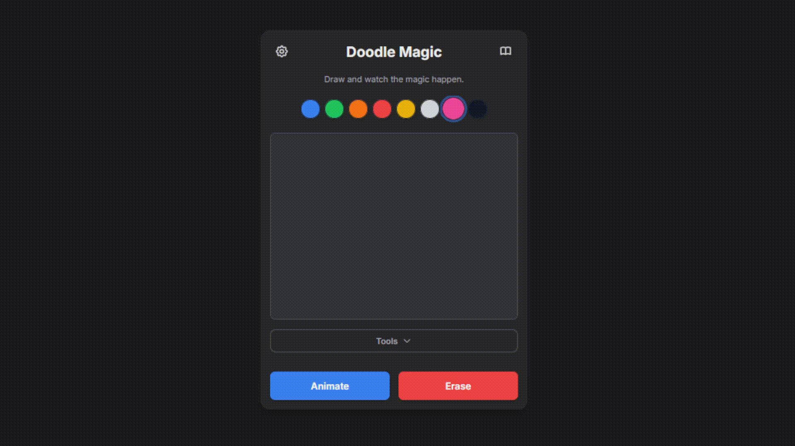
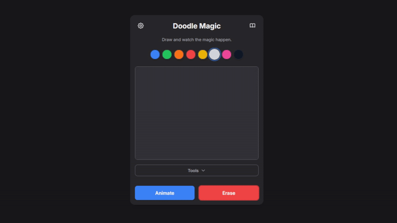
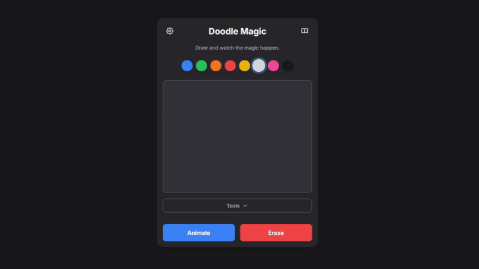
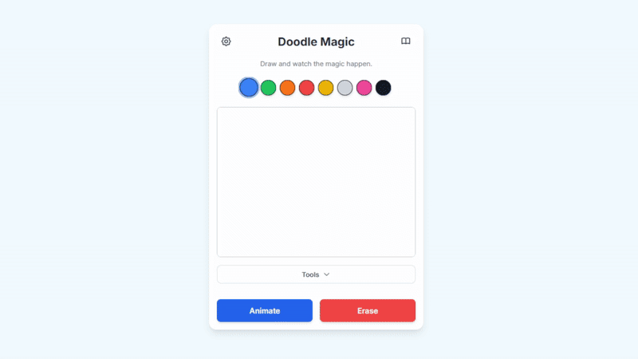

  

<h1 align="center">Magic Doodle</h1>

A creative animation tool built with AI assistance — from code to interface.

This web application stands as a testament to the power of **AI-assisted development**. Approximately **95% of this application's code was generated by Google's Gemini 2.5 Pro**. My role was to act as a **director and editor**, guiding the AI through a **~10-hour process of continuous prompting, testing, and making fine-tune adjustments** to integrate the generated code into a cohesive and fully functional application, yielding a final codebase of 1,300+ lines of code.

## ✨ Key Features
Doodle Magic is packed with features to provide a delightful and intuitive user experience, all conceptualized and coded primarily by the AI.

### 🎨 Drawing Interface
- **Responsive Canvas:**  
  A clean, responsive canvas that works on both desktop and mobile.
- **Color Palette:**  
  A simple and accessible color palette to bring your ideas to life.
- **Adjustable Brush Size:**  
  Easily change the thickness of your brush for more detailed drawings.
- **Undo/Redo:**  
  Don’t worry about mistakes! You can easily undo and redo your strokes.

### 🪄 Shape-Recognition Animation Engine
The core of Magic Doodle. The app intelligently analyzes your drawings to identify common shapes and applies a corresponding animation.  
Just draw and click **`Animate`**!
  - **Pulsing Hearts:** Draw a heart ❤️ and watch it beat.
  - **Gentle Rain:** Draw vertical lines 💧 and a rain animation will play over your existing doodle.
  - **Bouncing Balls:** Any circular shape 🏀 will start bouncing around the canvas.
  - **Floating Balloons:** Draw a circle with a string attached 🎈 and it will float away.
  - **Dancing Flowers:** Green stems with colorful tops 🌸 will sway gently.
  - **And more!** Discover other animations like twinkling stars, crackling fire, and floating ghosts.

### 🧘‍♂️ Focus Mode (`집중`)
 - **Distraction-Free Drawing:**  
      Enter Focus Mode to hide all UI elements except for the essential controls, providing a clean and immersive drawing experience.
 - **Keyboard Shortcut:**  
      Press **`Ctrl+F`** to activate.
  

### 📚 Interactive Animation Guide
- **Discover Animations:**  
  Not sure what you can create? Open the built-in guide to see a list of all available animations, including descriptions of how to trigger them.
- **Live Previews:**  
  Instantly preview any animation directly from the guide without affecting your current drawing.
- **Searchable:**  
  Quickly find the animation you’re looking for with a search bar.

### 💾 Project & File Management
- **Save as PNG:**  
  Export your static doodle or a frame of your animation as a high-quality PNG file.
- **Save & Load Projects:**  
  Save your entire drawing (including all strokes) to a custom `.doodle` file. You can load it back into the app later to continue your work.
- **Autosave:**  
  Enable autosave to automatically store your current drawing in your browser’s local storage, so you never lose your progress.

### ⚙️ Other Features
- **Dark Mode:**  
  A sleek, eye-friendly dark mode that can be toggled in the settings.
- **Keyboard Shortcuts:**  
  Use **`Ctrl+Z`** (Undo), **`Ctrl+Y`** (Redo), **`Esc`** to navigate the UI quickly and **`Ctrl+F`** to activate focus mode.
- **Touch Support:**  
  Fully functional on touch devices.
- **Polished UI:**  
  Smooth transitions and animations make the interface feel modern and responsive.

## 🛠️ The Development Process & Technologies
The technology stack was chosen and implemented by **Gemini 2.5 Pro** based on my high-level requirements.
- **HTML5**, **CSS3**, and modern **JavaScript (ES6+)** form the foundation of the application.
- **Tailwind CSS:** Used via CDN to rapidly style the user interface.
- **Self-Contained Code:** The entire application logic, styling, and structure are encapsulated within a single `index.html` file, demonstrating a lightweight, dependency-free approach.

## 🚀 How to Use
1. **Open** the `index.html` file (or the website) in any modern web browser.
2. **Start drawing!**

---

  Created and refined by <strong>MTDev</strong> using <strong>Gemini 2.5 Pro</strong>. 
  This repository is free to use under the CC0 1.0 Universal (Public Domain) license.

